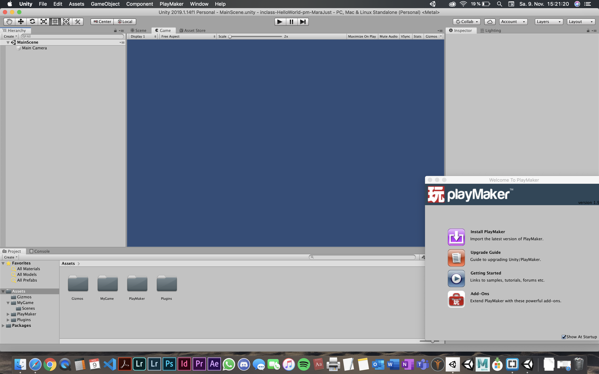

# inclass-HelloWorld-pm-MaraJust

### Project Description: 

2D project, practicing create unity project lokally and on GitHub, make the first Playmaker Project.

### Development platform: 

MacOS Mojave (10.14.6), Unity 2019.1.14f1, Visual Studio Code 1.38.1

### Target platform: 

WebGL (RefRes: 1280x720 HD-720p)  

### Game Control: 

no control

### Third Party Material: 

Playmaker 1.9.0.p9

### Screenshots:

### Limitations: 

TODO (I don't know what I have to write in here)
    
### Lessons Learned:

How to set up may first Playmaker Game
    
    
Copyright by MaraJust